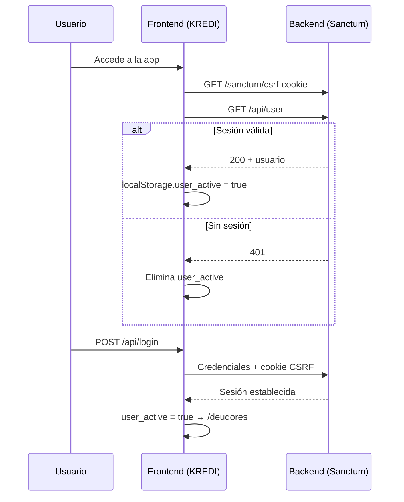
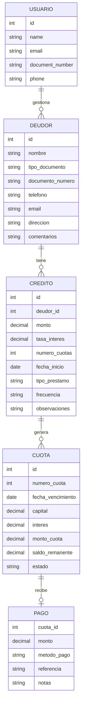

<div align="center">

# KREDI · www.crediorbit.com

**Sistema web de gestión de créditos, clientes y cobranza**

[](https://react.dev/)
[](https://vite.dev/)
[](https://tailwindcss.com/)
[](https://axios-http.com/)
[](https://reactrouter.com/)
[](https://eslint.org/)


*Frontend SPA para operaciones financieras de microcrédito o sistema de fiado — marca [Crediorbit](https://www.crediorbit.com)*


</div>


## Resumen ejecutivo

| Atributo | Detalle |
|----------|---------|
| **Desarrollador** | `Wilmer Restrepo (WILO)` |
| **Marca comercial** | **KREDI** (Crediorbit) |
| **Tipo** | Single Page Application (SPA) — **solo frontend** |
| **Repositorio** | [front_view-financial-software](https://github.com/Wilo92/front_view-financial-software) |
| **Backend requerido** | API REST compatible con **Laravel Sanctum** (no incluida en este repo) |

### Descripción

**KREDI** es la interfaz web de un sistema de gestión financiera orientado a **microcréditos, cobranza y fiados**. Permite a operadores autenticados administrar clientes (deudores), originar créditos con simulación de amortización en tiempo real, consultar cuotas pendientes por documento y registrar pagos con distintos métodos. Ademas una gestion de fiados para pequenos negocios y comerciantes.

### Problema que resuelve

Centraliza en una SPA moderna los flujos operativos que tradicionalmente se dispersan en hojas de cálculo o sistemas legacy:

- Registro y autenticación de usuarios.
- Alta y mantenimiento de cartera de clientes.
- Originación de créditos con múltiples esquemas de amortización.
- Consulta de obligaciones y registro de pagos.

### Propósito del sistema

Actuar como **capa de presentación** desacoplada del backend, consumiendo una API REST stateful basada en cookies de sesión Sanctum, con experiencia de usuario (animaciones, diseño responsive, validaciones en cliente).

---

##

| Vista | Ruta | Qué documentar |
|-------|------|----------------|
| Login | `/login` | Pantalla de acceso, animación Lottie, navbar de monedas |
| Registro | `/registro` | Formulario, indicador de fortaleza de contraseña |
| Clientes | `/deudores` | Listado, búsqueda, formulario CRUD |
| Nuevo crédito | `/creditos/crear/:id` | Formulario + tabla de simulación en tiempo real |
| Pagos | `/pagos` | Búsqueda por documento, modal de pago |
| Navbar / móvil | Global | Menú drawer, reloj zona Colombia |


## Buscando oportunidades 

### 

Desarrollador fullstack que entregó una **SPA de fintech** con React 19, integración real con **Laravel Sanctum** (CSRF + cookies), módulos CRUD completos, simulación financiera con debounce y UI production-ready con Tailwind v4.

### Decisiones de arquitectura destacadas

| Decisión | Por qué importa |
|----------|-----------------|
| **Cliente Axios centralizado** (`src/api/axios.js`) | Un solo punto para credenciales, CSRF y manejo global de 401 |
| **Proxy Vite en desarrollo** | Evita problemas CORS al apuntar `/api` y `/sanctum` a Laravel local |
| **Rutas anidadas con `ProtectedRoute`** | Patrón estándar React Router v6+ para zonas autenticadas |
| **Simulación debounced (500 ms)** | Reduce carga al backend mientras el usuario completa el formulario de crédito |
| **Estilos co-localizados por vista** | CSS-in-JSX por página; diseño consistente sin librería de componentes externa |
| **Sin estado global (Redux/Zustand)** | Simplicidad acorde al tamaño del proyecto; estado local por módulo |

### Habilidades evidenciadas

- Desarrollo SPA con **React 19** y **React Router 7**
- Integración **REST** con autenticación **cookie-based (Sanctum)**
- Diseño responsive y **UX financiera** (formato `es-CO`, estados de cuota, modales)
- Configuración de **Vite 7**, **Tailwind CSS 4**, **ESLint 9** (flat config)
- Validación de formularios y manejo de errores HTTP
- Organización modular por dominio (`pages/`, `components/`, `api/`)


## Tecnologías utilizadas

### Frontend

| Categoría | Tecnología | Versión |
|-----------|------------|---------|
| Framework UI | React | ^19.2.0 |
| DOM | React DOM | ^19.2.0 |
| Routing | React Router DOM | ^7.13.2 |
| Build tool | Vite | ^7.3.1 |
| Plugin React | @vitejs/plugin-react | ^5.1.1 |
| Estilos | Tailwind CSS | ^4.2.1 |
| PostCSS | @tailwindcss/postcss, autoprefixer | ^4.2.1 / ^10.4.27 |
| HTTP | Axios | ^1.13.6 |
| Iconos | react-icons | ^5.6.0 |
| Animación | @lottiefiles/dotlottie-react | ^0.18.9 |
| Lint | ESLint 9 (flat config) | ^9.39.1 |
| Lenguaje | JavaScript (JSX) | — |


## Arquitectura del proyecto

### Patrón general

```
┌─────────────────────────────────────────────────────────────┐
│                     NAVEGADOR (Cliente)                      │
│  ┌─────────────┐  ┌──────────────┐  ┌─────────────────────┐ │
│  │   Pages     │  │  Components  │  │  Hooks / Data       │ │
│  │ (Deudores,  │  │ (Navbar,     │  │ (useRandomPhrase,   │ │
│  │  Credito,   │  │  Footer,     │  │  frasesFooter)      │ │
│  │  Pagos...)  │  │  Protected)  │  │                     │ │
│  └──────┬──────┘  └──────┬───────┘  └─────────────────────┘ │
│         │                │                                   │
│         └────────┬───────┘                                   │
│                  ▼                                           │
│         ┌─────────────────┐                                  │
│         │  clienteAxios   │  ← api/axios.js                  │
│         │  (interceptors) │                                  │
│         └────────┬────────┘                                  │
└──────────────────┼──────────────────────────────────────────┘
                   │ HTTPS + Cookies + XSRF-TOKEN
                   ▼
┌─────────────────────────────────────────────────────────────┐
│              API REST (Laravel + Sanctum)                    │
│         /sanctum/csrf-cookie  ·  /api/*                      │
└─────────────────────────────────────────────────────────────┘
```

### Patrones de diseño

| Patrón | Implementación |
|--------|----------------|
| **SPA** | Una sola carga HTML; navegación client-side con React Router |
| **Layout condicional** | `AppContent` oculta Navbar en `/login`, aplica padding en rutas internas |
| **Route guard** | `ProtectedRoute` + `Outlet` para rutas hijas autenticadas |
| **API Client / Facade** | Instancia Axios dedicada con configuración centralizada |
| **Debounced side effect** | Simulación de crédito con `setTimeout` 500 ms |
| **Presentational state** | `useState` local por página; sin store global |
| **Custom hook** | `useRandomPhrase` para rotación de frases en footer |

### Flujo de autenticación



### Modularización

| Capa | Responsabilidad |
|------|-----------------|
| `src/pages/` | Vistas de negocio (deudores, crédito, pagos, registro) |
| `src/login/` | Módulo de autenticación |
| `src/components/` | UI compartida (Navbar, Footer, guard) |
| `src/api/` | Cliente HTTP |
| `src/hooks/` | Lógica reutilizable UI |
| `src/data/` | Datos estáticos |
| `src/assets/` | Imágenes y animaciones Lottie |

---

## 📁 Estructura del proyecto

```text
kartero_frontend/
├── public/                    # Assets estáticos servidos por Vite
├── src/
│   ├── api/
│   │   └── axios.js           # Cliente HTTP central (Sanctum, interceptores)
│   ├── assets/                # logo.png, Kredi.png, img.lottie
│   ├── components/
│   │   ├── Footer.jsx         # Pie de página, redes, frases rotativas
│   │   ├── Navbar.jsx         # Navegación, reloj CO, logout, drawer móvil
│   │   └── ProtectedRoute.jsx # Guard de rutas autenticadas
│   ├── data/
│   │   └── frasesFooter.js    # 50 frases motivacionales
│   ├── hooks/
│   │   └── userRandomPhrase.js # Hook: frase aleatoria cada 120s
│   ├── login/
│   │   └── Login.jsx          # Pantalla de inicio de sesión
│   ├── pages/
│   │   ├── Credito.jsx        # Originación + simulación de cuotas
│   │   ├── Deudores.jsx       # CRUD de clientes
│   │   ├── Pagos.jsx          # Consulta y registro de pagos
│   │   └── Registro.jsx       # Alta de usuarios
│   ├── services/              # (vacío — reservado)
│   ├── App.jsx                # Router + layout + check de sesión
│   ├── App.css                # Estilos plantilla Vite (sin uso relevante)
│   ├── index.css              # @import "tailwindcss"
│   └── main.jsx               # Entry point React
├── .env                       # Variables locales (gitignored)
├── .gitignore
├── eslint.config.js           # ESLint 9 flat config
├── index.html                 # Shell HTML (título: Kredi - crediorbit)
├── package.json
├── postcss.config.js
├── tailwind.config.js
└── vite.config.js             # Proxy /api y /sanctum → localhost:8000
```

### Descripción de módulos clave

| Módulo | Archivo(s) | Función |
|--------|------------|---------|
| **Bootstrap** | `main.jsx`, `index.html` | Monta React en `#root`, importa Tailwind |
| **Enrutamiento** | `App.jsx` | Define rutas públicas/protegidas y splash de carga |
| **HTTP** | `api/axios.js` | Base URL, credenciales, CSRF, redirect 401 |
| **Clientes** | `pages/Deudores.jsx` | CRUD completo con búsqueda local |
| **Créditos** | `pages/Credito.jsx` | Simulación debounced + persistencia |
| **Pagos** | `pages/Pagos.jsx` | Consulta por documento + modal de pago |
| **Auth** | `login/Login.jsx`, `pages/Registro.jsx` | Login y registro con Sanctum |
| **Shell** | `Navbar.jsx`, `Footer.jsx` | Navegación global y branding |

---

## ✨ Características principales

### Autenticación y usuarios

| Funcionalidad | Detalle |
|---------------|---------|
| Login | Email + contraseña, CSRF previo, redirección a `/deudores` |
| Registro | Campos: `name`, `document_number`, `email`, `phone`, `password` |
| Validación contraseña | Regex: 4–10 chars, 1 mayúscula, 1 número, 1 símbolo |
| Indicador fortaleza | Barra visual en registro |
| Verificación sesión | Al cargar app: CSRF + `GET /api/user` |
| Logout | `POST api/logout` + `localStorage.clear()` |
| Rutas protegidas | `/deudores`, `/creditos/crear/:id`, `/pagos` |

### Gestión de clientes (deudores)

| Funcionalidad | Detalle |
|---------------|---------|
| Listado | `GET /api/deudores` |
| Crear / editar | `POST` / `PUT /api/deudores/:id` |
| Eliminar | `DELETE` con `window.confirm` |
| Búsqueda local | Por nombre, documento, teléfono, email |
| Tipos documento | CC, NIT, CE, PP |
| Acceso a crédito | Navegación a `/creditos/crear/:id` |

### Originación de créditos

| Funcionalidad | Detalle |
|---------------|---------|
| Carga deudor | `GET /api/deudores/:id` desde parámetro URL |
| Simulación en vivo | `POST /api/creditos/simular` (debounce 500 ms) |
| Tipos de préstamo | `cuota_fija`, `abono_capital`, `solo_intereses`, `interes_simple` |
| Frecuencias | diario, semanal, quincenal, mensual |
| Totales | Capital, intereses y total calculados en cliente |
| Persistencia | `POST /api/creditos` |

### Pagos y cobranza

| Funcionalidad | Detalle |
|---------------|---------|
| Búsqueda | Por número de documento → `GET /api/cuotas/pendientes/:documento` |
| Vista agrupada | Créditos con cuotas pendientes |
| Estados visuales | pendiente, pagado, vencido |
| Registro pago | Modal con monto, método, referencia, notas |
| Métodos | efectivo, transferencia, consignación |
| Validación | Referencia obligatoria si método ≠ efectivo |

### UI / UX

| Elemento | Implementación |
|----------|----------------|
| Diseño | Paleta azul KREDI, tipografías Sora + DM Sans |
| Responsive | Grid adaptativo, drawer móvil en Navbar |
| Reloj | Zona horaria `America/Bogota` |
| Animaciones | Lottie en login, transiciones CSS por vista |
| Formato moneda | `toLocaleString("es-CO")` |
| Footer dinámico | 50 frases rotativas cada 2 minutos |

### Placeholders (menú sin implementar)

- **Reportes:** Estadísticas, Historial (`to: "#"`)
- **Auditoría:** Registros, Configuración (`to: "#"`)
- Recuperar contraseña en login (`href="#"`)

---

## 🔒 Seguridad

### Medidas implementadas en el frontend

| Medida | Archivo / detalle |
|--------|-------------------|
| **CSRF (Sanctum)** | `GET /sanctum/csrf-cookie` antes de login/registro |
| **Token XSRF** | `withXSRFToken: true` en `clienteAxios` |
| **Cookies de sesión** | `withCredentials: true` |
| **Interceptor 401** | Limpia `user_active` y redirige a `/login` |
| **`.env` en gitignore** | Evita commitear URL de API |
| **Escape XSS** | React escapa contenido por defecto; sin `dangerouslySetInnerHTML` |
| **Validación contraseña** | Regex en cliente antes de registro |
| **Referencia de pago** | Obligatoria para métodos no efectivo |

### Autenticación y autorización

| Aspecto | Comportamiento real |
|---------|---------------------|
| Mecanismo | Sesión por **cookie** (Sanctum), no JWT en localStorage |
| Guard de rutas | Flag `localStorage.user_active === 'true'` |
| Verificación real | Depende del backend vía `GET /api/user` al iniciar |
| CORS (dev) | Mitigado con **proxy Vite** hacia `127.0.0.1:8000` |
| CORS (prod) | Configuración del servidor API (no en este repo) |

### Lo que **no** está implementado en este repo

- Rate limiting
- CSP headers
- Sanitización HTML explícita
- RBAC / permisos por rol en UI
- Refresh token / rotación
- Tests de seguridad automatizados

### Recomendaciones de endurecimiento

1. Unificar cliente Axios (eliminar defaults en `main.jsx`).
2. Validar sesión en `ProtectedRoute` consultando `/api/user`, no solo `localStorage`.
3. No tratar HTTP 400 como login exitoso.
4. Corregir ruta logout: `api/logout` → `/api/logout`.
5. Añadir `.env.example` sin secretos.
6. Persistir `user_name` / `user_email` tras login si el API los devuelve.

---

## 🗄 Base de datos

> **Este repositorio no contiene backend ni migraciones.** El modelo siguiente se infiere de los payloads y respuestas consumidos por el frontend.

### Entidades inferidas



### Campos por formulario (frontend)

<details>
<summary><strong>Deudor</strong></summary>

| Campo | Tipo | Requerido |
|-------|------|-----------|
| `nombre` | string | Sí |
| `tipo_documento` | enum (CC, NIT, CE, PP) | Sí |
| `documento_numero` | string | Sí |
| `telefono` | string | Sí |
| `email` | string | No |
| `direccion` | string | No |
| `comentarios` | string | No |

</details>

<details>
<summary><strong>Crédito</strong></summary>

| Campo | Tipo | Requerido |
|-------|------|-----------|
| `deudor_id` | number | Sí |
| `monto` | number | Sí |
| `tasa_interes` | number | Sí |
| `numero_cuotas` | number | Sí |
| `fecha_inicio` | date | Sí |
| `tipo_prestamo` | enum | Sí (default: `cuota_fija`) |
| `frecuencia` | enum | Sí (default: `mensual`) |
| `observaciones` | string | No |

</details>

<details>
<summary><strong>Pago</strong></summary>

| Campo | Tipo | Requerido |
|-------|------|-----------|
| `cuota_id` | number | Sí |
| `monto` | number | Sí |
| `metodo_pago` | enum | Sí |
| `referencia` | string | Si método ≠ efectivo |
| `notas` | string | No |

</details>

---

## 🔌 API

### Configuración base

| Entorno | Base URL | Notas |
|---------|----------|-------|
| **Desarrollo** | `/` (relativo) + proxy Vite | Peticiones a `/api` y `/sanctum` → `http://127.0.0.1:8000` |
| **Producción** | `VITE_API_URL` | Ejemplo detectado: Railway |

### Autenticación de peticiones

1. `GET /sanctum/csrf-cookie` — obtiene cookie CSRF.
2. Axios envía automáticamente `X-XSRF-TOKEN` con `withXSRFToken: true`.
3. Cookie de sesión Laravel via `withCredentials: true`.

### Endpoints consumidos

| Método | Endpoint | Módulo | Descripción |
|--------|----------|--------|-------------|
| `GET` | `/sanctum/csrf-cookie` | App, Login, Registro | Inicializar protección CSRF |
| `GET` | `/api/user` | App | Verificar sesión activa |
| `POST` | `/api/login` | Login | Iniciar sesión |
| `POST` | `/api/register` | Registro | Crear usuario |
| `POST` | `api/logout` ⚠️ | Navbar | Cerrar sesión (sin `/` inicial) |
| `GET` | `/api/deudores` | Deudores | Listar clientes |
| `POST` | `/api/deudores` | Deudores | Crear cliente |
| `PUT` | `/api/deudores/:id` | Deudores | Actualizar cliente |
| `DELETE` | `/api/deudores/:id` | Deudores | Eliminar cliente |
| `GET` | `/api/deudores/:id` | Credito | Obtener cliente |
| `POST` | `/api/creditos/simular` | Credito | Simular plan de cuotas |
| `POST` | `/api/creditos` | Credito | Crear crédito |
| `GET` | `/api/cuotas/pendientes/:documento` | Pagos | Cuotas pendientes por documento |
| `POST` | `/api/pagos` | Pagos | Registrar pago |

### Formato de respuestas (observado)

| Caso | Formato |
|------|---------|
| Listado deudores | `res.data.data` o `res.data` (array) |
| Errores validación registro | `error.response.data.errors` (objeto campo → mensajes[]) |
| Error pago | `error.response.data.error` (string) |
| Éxito pago | `respuesta.data.mensaje` (string) |
| Cuotas pendientes | `{ deudor, creditos[] }` con `cuotas` anidadas |

### Ejemplos

**Login**

```http
GET /sanctum/csrf-cookie
Cookie: (se establece XSRF-TOKEN)

POST /api/login
Content-Type: application/json

{
  "email": "operador@empresa.com",
  "password": "MiClave1!"
}
```

**Simular crédito**

```http
POST /api/creditos/simular
Content-Type: application/json

{
  "deudor_id": "12",
  "monto": "5000000",
  "tasa_interes": "3.5",
  "numero_cuotas": "12",
  "fecha_inicio": "2026-06-01",
  "tipo_prestamo": "cuota_fija",
  "frecuencia": "mensual",
  "observaciones": ""
}
```

**Respuesta esperada (simulación):** array de cuotas con `numero_cuota`, `fecha_vencimiento`, `capital`, `interes`, `monto_cuota`, `saldo_remanente`, `estado`.

**Registrar pago**

```http
POST /api/pagos
Content-Type: application/json

{
  "cuota_id": 45,
  "monto": "450000",
  "metodo_pago": "transferencia",
  "referencia": "TRX-20260520-001",
  "notas": "Pago parcial"
}
```

### Rutas frontend (React Router)

| Ruta | Componente | Protegida |
|------|------------|-----------|
| `/` | Redirect → `/login` | No |
| `/login` | `Login` | No |
| `/registro` | `Registro` | No |
| `/deudores` | `Deudores` | Sí |
| `/creditos/crear/:id` | `Credito` | Sí |
| `/pagos` | `Pagos` | Sí |
| `*` | Redirect → `/login` | No |

---

## 🚀 Instalación

### Requisitos previos

| Requisito | Versión mínima recomendada |
|-----------|----------------------------|
| Node.js | 18+ (recomendado 20 LTS) |
| npm | 9+ |
| Backend Laravel + Sanctum | En `http://127.0.0.1:8000` (desarrollo) |

### Paso a paso

**1. Clonar el repositorio**

```bash
git clone https://github.com/Wilo92/front_view-financial-software.git
cd front_view-financial-software
```

**2. Instalar dependencias**

```bash
npm install
```

**3. Configurar variables de entorno**

```bash
cp .env.example .env   # Crear manualmente si no existe (ver sección Variables)
```

Contenido mínimo para **producción**:

```env
VITE_API_URL=https://tu-api-backend.com
```

Para **desarrollo local** con proxy Vite, puede omitirse `VITE_API_URL` (usa `/` como base).

**4. Levantar backend Laravel** (repositorio separado)

```bash
# En el proyecto Laravel (fuera de este repo)
php artisan serve --host=127.0.0.1 --port=8000
```

Asegurar CORS/Sanctum configurado para `http://localhost:5173` (puerto por defecto de Vite).

**5. Iniciar frontend**

```bash
npm run dev
```

Abrir `http://localhost:5173` (o el puerto que indique Vite).

**6. Build de producción**

```bash
npm run build
npm run preview   # Preview local del build
```

El artefacto se genera en `dist/` (gitignored).

---

## 🔐 Variables de entorno

| Variable | Obligatoria | Descripción | Ejemplo |
|----------|-------------|-------------|---------|
| `VITE_API_URL` | Prod: **Sí** · Dev: No | URL base del API backend. Si no se define, Axios usa `/` y Vite proxifica en desarrollo. | `https://api.ejemplo.com` |

> ⚠️ **Nunca** commitear `.env` con URLs o secretos reales. El archivo está en `.gitignore`.

### Crear `.env.example` (recomendado)

```env
# URL del API Laravel en producción
# En desarrollo, dejar vacío para usar el proxy de Vite (localhost:8000)
VITE_API_URL=
```

### Configuración hardcodeada (no es variable de entorno)

En `src/main.jsx` existe configuración legacy de Axios global:

```javascript
axios.defaults.withCredentials = true;
axios.defaults.baseURL = "http://localhost:8000"
```

Esto **no afecta** a `clienteAxios` de `api/axios.js`, pero puede generar confusión. Se recomienda eliminarla en una futura refactorización.

---

## 📜 Scripts disponibles

| Script | Comando | Descripción |
|--------|---------|-------------|
| `dev` | `vite` | Servidor de desarrollo con HMR |
| `build` | `vite build` | Compilación optimizada para producción |
| `preview` | `vite preview` | Servir carpeta `dist/` localmente |
| `lint` | `eslint .` | Análisis estático del código |
| `backend` | *(vacío)* | Placeholder — sin implementar |
| `fullstack` | *(vacío)* | Placeholder — sin implementar |

> `concurrently` está instalado pero los scripts `backend`/`fullstack` no lo utilizan aún.

---

## 💻 Flujo de desarrollo

### Arranque rápido

```bash
# Terminal 1 — Backend Laravel (repo externo)
php artisan serve --port=8000

# Terminal 2 — Frontend
npm run dev
```

### Proxy de desarrollo (Vite)

```javascript
// vite.config.js
proxy: {
  '/api':     { target: 'http://127.0.0.1:8000', changeOrigin: true },
  '/sanctum': { target: 'http://127.0.0.1:8000', changeOrigin: true }
}
```

### Debugging

| Área | Sugerencia |
|------|------------|
| Red | DevTools → Network; verificar cookies y `X-XSRF-TOKEN` |
| Sesión | Revisar respuesta de `GET /api/user` al cargar |
| 401 | Interceptor en `api/axios.js` redirige automáticamente |
| ESLint | `npm run lint` |

### Compilación

```bash
npm run build    # Salida: dist/
npm run lint     # Antes de PR/commit
```

---

## 🌐 Despliegue

### Requisitos

| Componente | Requisito |
|------------|-----------|
| Hosting frontend | Servidor estático o CDN (Netlify, Vercel, Nginx, S3+CloudFront, Railway static, etc.) |
| Build | `npm run build` |
| Variable | `VITE_API_URL` apuntando al API en producción |
| Backend | API Laravel accesible con CORS/Sanctum para el dominio del frontend |
| HTTPS | Recomendado para cookies `Secure` en producción |

### Pasos generales

1. Definir `VITE_API_URL` en el entorno de build (CI o panel del hosting).
2. Ejecutar `npm ci && npm run build`.
3. Publicar contenido de `dist/`.
4. Configurar **SPA fallback**: todas las rutas deben servir `index.html` (history API de React Router).

### Ejemplo Nginx (referencia)

```nginx
server {
    listen 80;
    root /var/www/kredi/dist;
    index index.html;

    location / {
        try_files $uri $uri/ /index.html;
    }
}
```

### Servidores compatibles

- Vercel, Netlify, Cloudflare Pages
- Nginx / Apache como reverse proxy
- Railway, Render (static site)
- Cualquier hosting que sirva archivos estáticos con fallback SPA

---

## ⚡ Rendimiento y optimización

### Prácticas detectadas

| Práctica | Ubicación |
|----------|-----------|
| **Debounce 500 ms** en simulación de crédito | `Credito.jsx` — reduce llamadas API |
| **Code splitting implícito** | Vite divide chunks automáticamente en build |
| **Assets Lottie** | `assetsInclude: ['**/*.lottie']` en Vite |
| **Estado local mínimo** | Sin librerías de estado pesadas |
| **CSS por componente** | Evita un bundle CSS monolítico global excesivo |

### Oportunidades de optimización

| Mejora | Beneficio |
|--------|-----------|
| Lazy loading de rutas (`React.lazy`) | Menor bundle inicial |
| Extraer CSS inline de JSX a archivos | Mejor cache y mantenibilidad |
| Memoización de listas grandes (`useMemo`) | Menos re-renders en Deudores/Pagos |
| Service Worker / PWA | Experiencia offline limitada |
| Sustituir `alert()` por toasts | UX más fluida |

---

## 🧪 Testing

| Framework | Estado |
|-----------|--------|
| Vitest | ❌ No configurado |
| Jest | ❌ No configurado |
| React Testing Library | ❌ No presente |
| E2E (Playwright/Cypress) | ❌ No presente |
| Archivos `*.test.*` / `*.spec.*` | ❌ Ninguno |

### Cómo añadir tests (recomendación)

```bash
npm install -D vitest @testing-library/react @testing-library/jest-dom jsdom
```

Casos prioritarios sugeridos:

- `ProtectedRoute` redirige sin `user_active`
- Interceptor 401 limpia sesión
- Validación de contraseña en `Registro.jsx`
- `puedeConfirmar` en modal de pagos

---

## 🔮 Mejoras futuras

### Funcionalidad

- [ ] Implementar módulos **Reportes** y **Auditoría** (actualmente placeholder)
- [ ] Recuperación de contraseña
- [ ] Dashboard con KPIs de cartera
- [ ] Historial de pagos por cliente
- [ ] Exportación PDF/Excel de simulaciones

### Técnico

- [ ] Migrar a **TypeScript**
- [ ] Unificar cliente Axios; eliminar config en `main.jsx`
- [ ] Corregir rutas del `Navbar` (`/deudores`, `/pagos`, etc.)
- [ ] Añadir `.env.example`, Docker Compose fullstack, GitHub Actions CI
- [ ] Implementar tests unitarios y E2E
- [ ] Capa `src/services/` para lógica API desacoplada de componentes
- [ ] Context API o Zustand para usuario autenticado
- [ ] Completar scripts `backend` / `fullstack` con `concurrently`
- [ ] i18n si se requiere multi-país

### Escalabilidad

- Paginación server-side en listado de deudores
- Caché de simulaciones recientes
- WebSockets para actualización de pagos en tiempo real

---

## 🎓 Lecciones técnicas del proyecto

Este proyecto demuestra capacidad para:

1. **Entregar producto fintech completo en frontend** — no solo maquetación, sino flujos de negocio reales conectados a API.
2. **Integrar autenticación empresarial** — Sanctum con CSRF es el estándar en ecosistemas Laravel; manejar cookies + SPA es un skill buscado.
3. **Modelar dominio financiero** — múltiples tipos de amortización, frecuencias, estados de cuota, métodos de pago.
4. **Diseñar UX bajo presión operativa** — búsqueda rápida, simulación en vivo, confirmaciones, feedback visual.
5. **Configurar toolchain moderno** — Vite 7, React 19, Tailwind 4, ESLint flat config.
6. **Trabajar en arquitectura desacoplada** — frontend y backend independientes, listos para despliegue separado.

---

## 👤 Autor

<div align="center">

### Wilmer Restrepo · @wilo

*Desarrollador Frontend · Sistemas de gestión financiera*

[](https://github.com/Wilo92)
[](https://www.linkedin.com/in/wilmer-restrepo-830544242/)
[](https://www.wilolink.online)
[](https://www.crediorbit.com)

</div>

**Proyecto:** KREDI / Kartero — Frontend de software financiero  
**Organización:** [Crediorbit](https://www.crediorbit.com)  
**Repositorio:** [github.com/Wilo92/front_view-financial-software](https://github.com/Wilo92/front_view-financial-software)

---

## 📄 Licencia

No se encontró un archivo `LICENSE` en la raíz del repositorio. Los paquetes npm dependientes utilizan principalmente licencias **MIT** y **Apache-2.0** según `package-lock.json`.

**Recomendación:** Añadir un archivo `LICENSE` explícito (por ejemplo MIT) antes de distribución pública o uso comercial.

---

<div align="center">

**KREDI** — *Gestión de crédito inteligente* 🐾

Desarrollado con React · Vite · Tailwind · Axios

</div>
